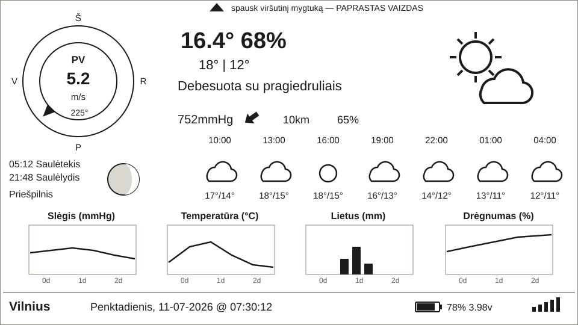
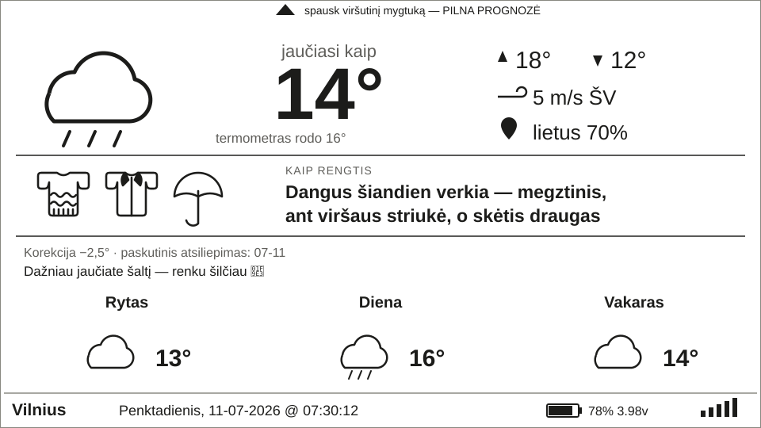

# eInkWeather — orų stotelė su e-ink ekranu / e-ink weather station

**Lietuviškai** · [English below ↓](#english)

---

Baterija maitinama namų orų stotelė: **ESP32-S3 + LilyGo EPD47 4,7" e-ink ekranas** (960×540).
Orus gauna iš OpenWeatherMap, atsinaujina kas 30 min., naktį miega — su viena baterija veikia
mėnesiais. Sąsaja lietuvių kalba, su tikromis lietuviškomis raidėmis (ą, č, ę, ė, į, š, ų, ū, ž).

## Du režimai

Perjungiami plokštės mygtuku (GPIO21) — įrenginys pabunda, parsisiunčia šviežius orus ir
perpiešia ekraną. Pasirinkimas išlieka per miego ciklus.

### Pilnas režimas

Visa informacija: vėjo rožė lietuviškomis kryptimis, astronomija, slėgis (mmHg) su tendencija,
3 parų prognozė kas 3 val. ir grafikai (sniego grafikas rodomas tik žiemą — kitu metu jo vietoje drėgnumas).

### Paprastasis („žmonos") režimas

Be grafikų: **jutiminė** temperatūra dideliu skaičiumi (kaip iš tikrųjų jaučiasi — būtent tai
svarbu, ne teorinis termometro rodmuo), termometro rodmuo mažesniu, ir šmaikštus patarimas,
kaip rengtis, su drabužių piktogramomis (maikutė, megztinis, striukė, kepurė, skėtis) bei
dienos eiga rytas / diena / vakaras.

## Savaime besimokantys patarimai (Telegram)

- Vakare botas paklausia: *„Kaip šiandien tiko apranga?"* — 🥶 Buvo šalta / 👍 Kaip tik / 🥵 Buvo karšta.
- Atsakymas koreguoja „šilumos koeficientą" (±0,5 °C, ribos −5…+1 °C, saugomas NVS) — stotelė
  per kelias savaites prisitaiko prie šeimininkės, kuri, tarkim, nemėgsta šalčio.
- Baterijai nusekus iki 10 % botas atsiunčia perspėjimą 🪫.

## Savybės

| | |
|---|---|
| WiFi nustatymas | WiFiManager AP portalas (`OruStotele-Setup` → 192.168.4.1), instrukcijos rodomos pačiame e-ink ekrane |
| Nustatymai per naršyklę | Ilgas (>3 s) mygtuko paspaudimas atidaro portalą: OWM API raktas, miestas, nakties/ryto valandos, Telegram token — jokių failų redagavimo |
| Baterijos taupymas | Gilus miegas tarp atnaujinimų; naktį (23–5 val.) miega vienu ypu; pabudus iš miego AP portalas neatidaromas |
| Lietuviški šriftai | Generuojami `scripts/fontconvert_lt.py` (Latin Extended-A glifai + 48 pt skaitmenų šriftas temperatūrai) |
| Telegram | Grįžtamasis ryšys, koeficiento mokymasis, baterijos perspėjimai — be jokio išorinio serverio |
| Konfigūracija | `include/owm_credentials.h` (gitignore); šablonas `owm_credentials_template.h` |

## Paleidimas

1. Nukopijuokite `include/owm_credentials_template.h` → `include/owm_credentials.h`, įrašykite
   [OpenWeatherMap API raktą](https://openweathermap.org/) ir (nebūtina) Telegram boto token'ą.
2. `pio run -t upload` (VS Code + PlatformIO, plokštė `esp32-s3-devkitc-1`).
3. WiFi nustatykite telefonu per AP portalą — instrukcijos ekrane.

Išsamiau — [NAUDOTOJO_VADOVAS.md](NAUDOTOJO_VADOVAS.md).

---

# English

A battery-powered home weather station: **ESP32-S3 + LilyGo EPD47 4.7" e-ink display** (960×540).
It fetches weather from OpenWeatherMap, refreshes every 30 minutes and deep-sleeps at night —
months of runtime on a single battery. The UI is in Lithuanian, with proper Lithuanian
diacritics (ą, č, ę, ė, į, š, ų, ū, ž) rendered by custom-generated fonts.

## Two display modes

Toggled with the on-board button (GPIO21) — the device wakes, fetches fresh weather and
redraws the screen. The selected mode persists across sleep cycles.

- **Full mode** — everything: wind rose with Lithuanian cardinal directions, astronomy,
  pressure (mmHg) with trend, 3-day/3-hour forecast strip and four graphs (the snowfall graph
  appears only when snow is forecast; otherwise humidity is shown — see mockup above).
- **Simple ("wife") mode** — no graphs: the **feels-like** temperature as the big number (what
  it actually feels like — that's what matters, not the theoretical thermometer reading), the
  thermometer reading smaller, plus witty plain-language advice on what to wear, with clothing
  pictograms (t-shirt, sweater, jacket, beanie, umbrella) and a morning / afternoon / evening strip.

## Self-learning clothing advice (Telegram)

- In the evening the bot asks *"How did today's outfit advice work out?"* with three inline
  buttons: 🥶 Too cold / 👍 Just right / 🥵 Too warm.
- Each answer nudges a "warmth coefficient" by ±0.5 °C (clamped to −5…+1 °C, persisted in NVS),
  so over a few weeks the station adapts to its cold-sensitive owner.
- When the battery drops to 10 %, the bot sends a warning 🪫.

No external server required — the ESP32 talks to the Telegram Bot API directly and picks up
replies on its next wake-up.

## Features

| | |
|---|---|
| WiFi provisioning | WiFiManager captive portal (`OruStotele-Setup` → 192.168.4.1), instructions shown on the e-ink display itself |
| Browser settings | A long (>3 s) button press opens a portal: OWM API key, city, night/morning hours, Telegram token — no file editing |
| Power saving | Deep sleep between updates; single uninterrupted sleep at night (23:00–5:00); the portal never opens on wake-from-sleep |
| Lithuanian fonts | Generated by `scripts/fontconvert_lt.py` (Latin Extended-A glyphs + a digits-only 48 pt font for the big temperature) |
| Telegram | Feedback loop, coefficient learning, battery alerts — fully on-device |
| Configuration | `include/owm_credentials.h` (gitignored); template provided as `owm_credentials_template.h` |

## Getting started

1. Copy `include/owm_credentials_template.h` → `include/owm_credentials.h`, fill in your
   [OpenWeatherMap API key](https://openweathermap.org/) and (optionally) a Telegram bot token.
2. `pio run -t upload` (VS Code + PlatformIO, board `esp32-s3-devkitc-1`).
3. Provision WiFi from your phone via the captive portal — instructions appear on the display.

Full user manual (in Lithuanian): [NAUDOTOJO_VADOVAS.md](NAUDOTOJO_VADOVAS.md).

---

## Autorystė ir licencijos / Attribution & licenses

Šis projektas yra asmeninė, nekomercinė modifikacija atvirojo kodo pagrindu. /
This project is a personal, non-commercial modification built on open-source work.

- **Bazinis kodas / Original code**: [LilyGo-EPD-4-7-OWM-Weather-Display](https://github.com/G6EJD/LilyGo-EPD-4-7-OWM-Weather-Display)
  v2.5 — **Copyright (c) David Bird (G6EJD) 2021**. All rights to this software are reserved;
  used for personal, non-commercial purposes under the author's licence terms, with the
  copyright notice retained in the `src/main.cpp` header. Author's site: http://g6ejd.dynu.com/
- **Ekrano tvarkyklė / Display driver**: [LilyGo-EPD47](https://github.com/Xinyuan-LilyGO/LilyGo-EPD47) (Xinyuan-LilyGO) — GPL-3.0,
  vendored in `lib/LilyGo-EPD47-1.0.1/` (licence text included there).
- **WiFiManager**: [tzapu/WiFiManager](https://github.com/tzapu/WiFiManager) — MIT.
- **ArduinoJson**: [bblanchon/ArduinoJson](https://github.com/bblanchon/ArduinoJson) — MIT.
- **Šriftai / Fonts**: glyphs generated from the Windows system font Segoe UI Bold (personal
  device use; for public redistribution regenerate from [Open Sans](https://fonts.google.com/specimen/Open+Sans),
  SIL OFL — see `scripts/fontconvert_lt.py`).

Modifikacijos / Modifications (WiFiManager integration, Lithuanian localisation, simple mode,
Telegram feedback loop, bug fixes) — © 2026 Viktoras Sidlauskas, under the same non-commercial
terms as the original D. Bird code.
