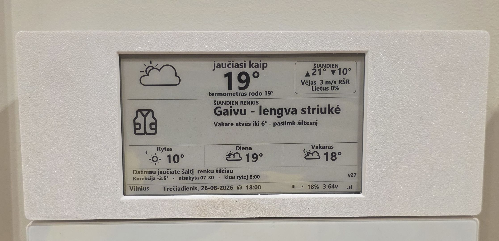
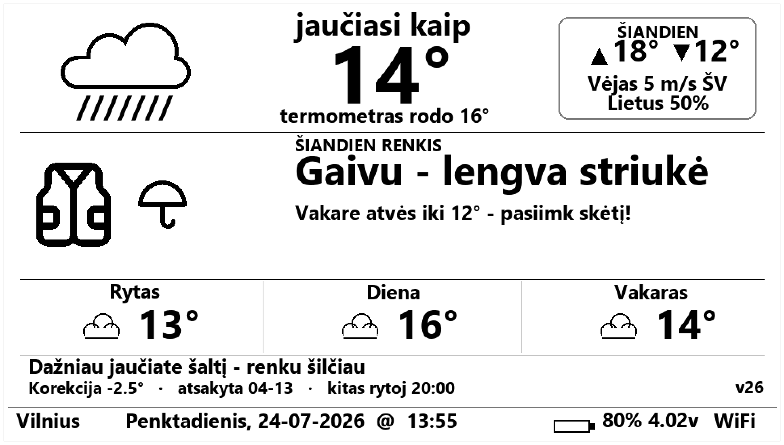
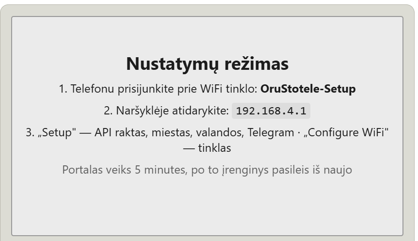
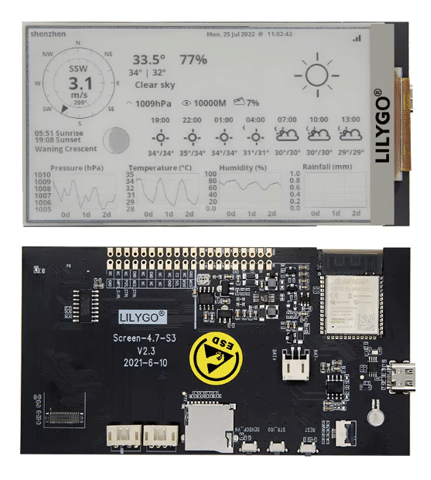
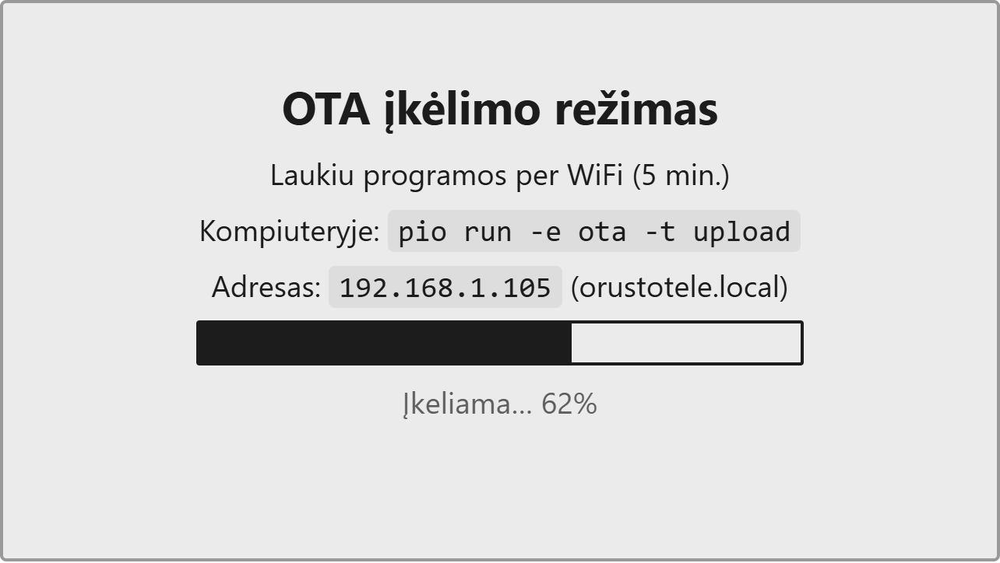

# eInkWeather — orų stotelė su e-ink ekranu / e-ink weather station

**Lietuviškai** · [English below ↓](#english)

  

---

Baterija maitinama namų orų stotelė: **ESP32-S3 + LilyGo EPD47 4,7" e-ink ekranas** (960×540).
Orus gauna iš OpenWeatherMap, atsinaujina kas 30 min., naktį miega — su viena baterija veikia
mėnesiais. Sąsaja lietuvių kalba, su tikromis lietuviškomis raidėmis (ą, č, ę, ė, į, š, ų, ū, ž).

## Du režimai

Perjungiami plokštės mygtuku (GPIO21) — įrenginys pabunda, parsisiunčia šviežius orus ir
perpiešia ekraną. Pasirinkimas išlieka per miego ciklus.

### Pilnas režimas

Visa informacija: vėjo rožė lietuviškomis kryptimis, astronomija, slėgis (mmHg) su tendencija,
3 parų prognozė kas 3 val. ir grafikai (sniego grafikas rodomas tik žiemą — kitu metu jo vietoje drėgnumas).

### Paprastasis („žmonos") režimas

Be grafikų: **jutiminė** temperatūra dideliu skaičiumi (kaip iš tikrųjų jaučiasi — būtent tai
svarbu, ne teorinis termometro rodmuo), termometro rodmuo mažesniu, ir šmaikštus patarimas,
kaip rengtis, su drabužių piktogramomis (pagal jutiminę temperatūrą — nuo maikutės iki pūkinės,
plius aksesuarai: šalikas / skėtis), dienos maks/min „ŠIANDIEN" skydelyje bei dienos eiga
rytas / diena / vakaras.

## Drabužių parinkimo taisyklės

Patarimas parenkamas pagal **jutiminę** temperatūrą (OWM `feels_like`) su pridėta korekcija
`ChillBias` (mokosi iš atsiliepimų, žr. žemiau). Gauta reikšmė (`jaučiasi + ChillBias`) patenka
į vieną iš **septynių** juostų:

| Jutiminė (su korekcija) | Pagrindinis drabužis | Pavyzdinė frazė |
|---|---|---|
| ≥ 23 °C | maikutė | „Vasara! Užteks maikutės" |
| 21–23 °C | marškinėliai | „Šilta – marškinėliai kaip tik" |
| 18–21 °C | plonas švarkelis | „Vėsoka vasara – plonas švarkelis" |
| 16–18 °C | megztinis | „Megztinis: nei šalta, nei karšta" |
| 9–16 °C | striukė | „Gaivu – lengva striukė" |
| −3–9 °C | paltas | „Šalta – laikas paltui" |
| < −3 °C | pūkinė | „Speigas! Pūkinė ir jokių kompromisų" |

Kiekviena juosta turi 3 frazių variantus, kurie keičiasi kasdien (ta pati diena – ta pati frazė).
Papildomi **aksesuarai** pridedami pagal orą:

- **Stiprus vėjas** (≥ 8 m/s) → **šalikas**, „Vėjas piktas – užsisek šaliką".
- **Smarkus lietus** (> 2 mm arba tikimybė ≥ 60 %) → drabužis su **kapišonu**.
- **Lietus** (lyja arba tikimybė ≥ 35 %) → **skėtis**, „Pasiimk skėtį".
- **Sniegas** → „Sninga – neperšlampami batai!".

Ekrane vienu metu rodomas **vienas didelis** pagrindinio drabužio paveikslėlis (124 px) ir iki
**dviejų mažesnių** aksesuarų (72 px); teksto vieta fiksuota, todėl išdėstymas nešokinėja.
Piktogramos yra nespalvoti **bitmapai** (`include/clothing_icons.h`), sugeneruoti iš tikrų
vektorinių (iconify) ikonų, identiški [maketui](docs/mockup_zmonos.png). Dienos oro permainos
primenamos patarimo tekste („Po pietų iki X° – renkis sluoksniais" / „Vakare atvės iki X°").

## Savaime besimokantys patarimai (Telegram)

- Vakare botas paklausia **žmonos**: *„Kaip šiandien tiko apranga?"* su keturiais mygtukais:
  🥶 Buvo šalta / 👍 Kaip tik / 🥵 Buvo karšta / 🤷 Nesilaikiau patarimo.
- Paspaudus mygtuką telefone iššoka patvirtinimas **„Užskaityta ✅"**, o žinutė pasikeičia į
  „Atsakyta: …" (mygtukai dingsta), tad aišku, kad nuomonė gauta.
- „Šalta"/„Karšta" koreguoja **šilumos koeficientą** `ChillBias` po ±0,5 °C (ribos −5…+1 °C, NVS).
  „Nesilaikiau" koeficiento nekeičia — tik įskaitomas į statistiką. Stotelė per kelias savaites
  prisitaiko prie šeimininkės, kuri nemėgsta šalčio, ir tai **matosi žmonos ekrane** (korekcija,
  paskutinio atsiliepimo data ir besikeičianti išvada, pvz. „dažniau jaučiate šaltį — renku šilčiau").
- **Du gavėjai** (vienas botas, du chat ID): *adminas* gauna būseną, baterijos perspėjimus ir
  žmonos atsiliepimų kopijas; *žmona* gauna tik vakarinį klausimą. Žmona prijungiama per
  `/kvietimas` (persiunčiamas deep-link — jai užtenka paspausti PRADĖTI); rankinė registracija —
  `/adminas` ir `/zmona`.
- **Vakarinis klausimas** atsiunčiamas su trumpu tos dienos oru ir tos dienos drabužių
  **nuotrauka** (numatyta) arba **emoji** (`/foto` `/emoji`); ankstesnis klausimas iš pokalbio
  ištrinamas (nebent įjungta `/history`), kad liktų tik naujausias.
- Baterijai nusekus iki 10 % adminas gauna perspėjimą 🪫.

  

## Savybės

| | |
|---|---|
| WiFi nustatymas | WiFiManager AP portalas (`OruStotele-Setup` → 192.168.4.1), instrukcijos rodomos pačiame e-ink ekrane |
| Nustatymai per naršyklę | Mygtuko paspaudimas 3–8 s atidaro portalą: WiFi, OWM API raktas, miestas, šalis, ryto/nakties valandos, Telegram token, chat ID, OTA raktas — jokių failų redagavimo |
| Baterijos taupymas | Gilus miegas tarp atnaujinimų; naktį (23–5 val.) miega vienu ypu; pabudus iš miego AP portalas neatidaromas |
| Lietuviški šriftai | Generuojami `scripts/fontconvert_lt.py` (Latin Extended-A glifai + 48 pt skaitmenų šriftas temperatūrai) |
| Telegram | Grįžtamasis ryšys, koeficiento mokymasis, baterijos perspėjimai — be jokio išorinio serverio |
| Konfigūracija | Visi nustatymai saugomi įrenginio atmintyje (NVS) ir įvedami per portalą; `include/owm_credentials.h` (gitignore) tereikia tik kompiliavimui / pradinėms numatytosioms reikšmėms; šablonas `owm_credentials_template.h` |

WiFi ir kiti nustatymai vedami telefonu per portalą — instrukcijos rodomos pačiame e-ink ekrane:

  

## Geležis

Pagrindas — **LilyGo T5 4.7" EPD (ESP32-S3)** plokštė: ESP32-S3 (16 MB flash, PSRAM),
integruotas 960×540 e-ink ekranas, USB‑C, baterijos jungtis ir keli mygtukai. Programoje
naudojama: **GPIO21** — režimo/nustatymų mygtukas, **GPIO14** — baterijos įtampos matavimas
(daliklis, kalibruota per `esp_adc_cal`). PlatformIO plokštė — `esp32-s3-devkitc-1`.

  

> Nuotraukoje — gamintojo (LilyGo) demonstracinis ekranas; realiai įrenginys rodo lietuvišką
> sąsają, kaip aukščiau esančiuose maketuose.

## Paleidimas

**Visi nustatymai — telefonu, jokio kodo redagavimo.** Palaikykite plokštės mygtuką 3–8 s,
prisijunkite prie WiFi tinklo `OruStotele-Setup`, atidarykite `192.168.4.1` ir įrašykite savo
WiFi, [OpenWeatherMap API raktą](https://openweathermap.org/), miestą, ryto/nakties valandas ir
(nebūtina) Telegram token'ą. Instrukcijos rodomos pačiame e-ink ekrane; viskas saugoma įrenginio
atmintyje (NVS).

Firmware įkėlimas iš šaltinio (vieną kartą, nustatymų čia neįvedinėjama)

1. Nukopijuokite `include/owm_credentials_template.h` → `include/owm_credentials.h` (be šio failo
   kodas nesikompiliuoja; reikšmių keisti nereikia — jas įvesite portale, žr. aukščiau).
2. `pio run -t upload` (VS Code + PlatformIO, plokštė `esp32-s3-devkitc-1`).

> `owm_credentials.h` reikšmės naudojamos tik kaip pradinės numatytosios; portale įvesti
> nustatymai perrašo jas ir lieka NVS net atjungus maitinimą.

Išsamiau — [NAUDOTOJO_VADOVAS.md](NAUDOTOJO_VADOVAS.md). Gražus naudotojo manualas —
[docs/manualas.html](docs/manualas.html) (atverti naršyklėje; taip pat gaunamas Telegram
komanda `/vadovas`).

## OTA — atnaujinimas per WiFi

Firmware atnaujinamas belaidžiu būdu, **be USB laido ir be kompiuterio**: telefone parašius botui
`/atnaujinti`, įrenginys pats patikrina GitHub ir įsidiegia naujausią versiją. Reikia tik vieną
kartą įvesti GitHub raktą — komanda `/pat github_pat_…` arba Setup portale (mygtukas 3–8 s, laukas
„GitHub raktas"). Įkėlimo eiga rodoma **progreso juosta pačiame e-ink ekrane**, tad matyti, kiek liko.

  

Rankinis įkėlimas iš kompiuterio (programuotojui)

Laikant mygtuką ≥8 s įrenginys pereina į OTA režimą, tada kompiuteryje `pio run -e ota -t upload`
siunčia firmware per tinklą (dalinis ekrano atnaujinimas per `epd_push_pixels`). OTA lange dar
kartą spustelėjus mygtuką — paleidžiamas Telegram ryšio testas.

## Interaktyvus prototipas

**▶ Paleisti naršyklėje: <https://tinymakerwifi.com/orai>** — įrenginio ekrano, mygtuko
pakopų (trumpas / 3–8 s / ≥8 s) ir Telegram grandinės simuliacija: perjunkite režimus,
atidarykite portalą, paleiskite OTA su progreso juosta, atsakykite į vakarinį klausimą ir
stebėkite, kaip keičiasi ekranas. Tą pačią nuorodą gauna ir Telegram komanda `/demo`.

> Šaltinis: [docs/prototipas.html](docs/prototipas.html). GitHub'e ši nuoroda atidaro failo
> **kodą**, ne paleidžia — paleidimui naudokite viešą nuorodą aukščiau arba dukart spustelėkite
> `docs\prototipas.html` klonavę repo.

---

# English

A battery-powered home weather station: **ESP32-S3 + LilyGo EPD47 4.7" e-ink display** (960×540).
It fetches weather from OpenWeatherMap, refreshes every 30 minutes and deep-sleeps at night —
months of runtime on a single battery. The UI is in Lithuanian, with proper Lithuanian
diacritics (ą, č, ę, ė, į, š, ų, ū, ž) rendered by custom-generated fonts.

## Two display modes

Toggled with the on-board button (GPIO21) — the device wakes, fetches fresh weather and
redraws the screen. The selected mode persists across sleep cycles.

- **Full mode** — everything: wind rose with Lithuanian cardinal directions, astronomy,
  pressure (mmHg) with trend, 3-day/3-hour forecast strip and four graphs (the snowfall graph
  appears only when snow is forecast; otherwise humidity is shown — see mockup above).
- **Simple ("wife") mode** — no graphs: the **feels-like** temperature as the big number (what
  it actually feels like — that's what matters, not the theoretical thermometer reading), the
  thermometer reading smaller, plus witty plain-language advice on what to wear, with clothing
  pictograms (by feels-like temperature — from a t-shirt to a down jacket, plus a scarf/umbrella),
  the day's high/low in a "TODAY" panel and a morning / afternoon / evening strip.

## Clothing rules

Advice is chosen from the **feels-like** temperature plus a learned `ChillBias` offset (see below),
which falls into one of **seven** bands:

| Feels-like (with offset) | Main garment | Example line |
|---|---|---|
| ≥ 23 °C | t-shirt | "Summer! A t-shirt is enough" |
| 21–23 °C | shirt | "Warm – a shirt is just right" |
| 18–21 °C | light jacket | "Coolish summer – a light jacket" |
| 16–18 °C | sweater | "Sweater: neither cold nor hot" |
| 9–16 °C | jacket | "Fresh – a light jacket" |
| −3–9 °C | coat | "Cold – time for a coat" |
| < −3 °C | down jacket | "Freezing! Down jacket, no compromises" |

Each band has 3 phrasings that rotate daily. Weather **accessories** are added on top: strong
wind (≥ 8 m/s) → a **scarf**; heavy rain (> 2 mm or ≥ 60 % chance) → a **hooded** garment; rain
(or ≥ 35 % chance) → an **umbrella**; snow → "waterproof boots". On screen one large main-garment
image (124 px) shows with up to two smaller accessories (72 px); the text position is fixed so the
layout never shifts. The pictograms are 1-bpp **bitmaps** (`include/clothing_icons.h`) generated
from real vector (iconify) icons, identical to the [mockup](docs/mockup_zmonos.png).

## Self-learning clothing advice (Telegram)

- In the evening the bot asks the **wife**: *"How did today's outfit advice work out?"* with four
  inline buttons: 🥶 Too cold / 👍 Just right / 🥵 Too warm / 🤷 Didn't follow it.
- Tapping a button pops up a **"Recorded ✅"** toast and the message updates to "Answered: …"
  (buttons disappear), so it's clear the opinion was received.
- Cold/Warm nudge a **warmth coefficient** `ChillBias` by ±0.5 °C (clamped to −5…+1 °C, NVS).
  "Didn't follow" leaves the coefficient unchanged and only feeds the stats. The adaptation is
  **visible on the wife's screen** (the offset, the last-feedback date, and a changing verdict
  such as "you feel the cold more — dressing you warmer").
- **Two recipients** (one bot, two chat IDs): the *admin* gets status, battery warnings and copies
  of the wife's answers; the *wife* only gets the evening question. The wife is added via a
  forwarded `/kvietimas` deep-link (she just taps START); manual registration is `/adminas` /
  `/zmona`. The evening question includes the day's short weather and a clothing **photo** (default)
  or **emoji** (`/foto` `/emoji`); the previous question is deleted unless `/history` is on.
- When the battery drops to 10 %, the admin gets a warning 🪫.

No external server required — the ESP32 talks to the Telegram Bot API directly and picks up
replies on its next wake-up.

  

## Features

| | |
|---|---|
| WiFi provisioning | WiFiManager captive portal (`OruStotele-Setup` → 192.168.4.1), instructions shown on the e-ink display itself |
| Browser settings | A 3–8 s button press opens a portal: WiFi, OWM API key, city, country, morning/night hours, Telegram token, chat IDs, OTA key — no file editing |
| Power saving | Deep sleep between updates; single uninterrupted sleep at night (23:00–5:00); the portal never opens on wake-from-sleep |
| Lithuanian fonts | Generated by `scripts/fontconvert_lt.py` (Latin Extended-A glyphs + a digits-only 48 pt font for the big temperature) |
| Telegram | Feedback loop, coefficient learning, battery alerts — fully on-device |
| Configuration | All settings live in the device's flash (NVS) and are entered via the portal; `include/owm_credentials.h` (gitignored) is only needed for compilation / initial defaults; template as `owm_credentials_template.h` |

WiFi and other settings are entered from your phone via the portal — instructions are shown on the e-ink display itself:

  

## Hardware

Built on the **LilyGo T5 4.7" EPD (ESP32-S3)** board: an ESP32-S3 (16 MB flash, PSRAM), an
integrated 960×540 e-ink panel, USB‑C, a battery connector and a few buttons. The firmware uses
**GPIO21** for the mode/settings button and **GPIO14** for battery-voltage sensing (divider,
calibrated via `esp_adc_cal`). PlatformIO board: `esp32-s3-devkitc-1`.

  

> The screen in the photo is the manufacturer's (LilyGo) demo; the actual device shows the
> Lithuanian UI shown in the mockups above.

## Getting started

**All settings are entered from your phone — no code editing.** Hold the on-board button for
3–8 s, join the `OruStotele-Setup` WiFi network, open `192.168.4.1` and fill in your WiFi, the
[OpenWeatherMap API key](https://openweathermap.org/), city, morning/night hours and (optionally)
a Telegram token. Instructions appear on the e-ink display; everything is stored in the device's
flash (NVS). Firmware is updated the same way — over the air via the Telegram `/atnaujinti`
command, no cable needed.

Flashing from source (one-time; no settings entered here)

1. Copy `include/owm_credentials_template.h` → `include/owm_credentials.h` (the code won't compile
   without it; you don't need to edit the values — you'll enter them in the portal above).
2. `pio run -t upload` (VS Code + PlatformIO, board `esp32-s3-devkitc-1`).

The values in `owm_credentials.h` are only initial defaults; portal settings override them and
persist in NVS.

Full user manual (in Lithuanian): [NAUDOTOJO_VADOVAS.md](NAUDOTOJO_VADOVAS.md).

**Interactive prototype** (runs in browser): <https://tinymakerwifi.com/orai> — simulation of
the e-ink screen, the three button-hold tiers and the Telegram feedback loop. Source:
[docs/prototipas.html](docs/prototipas.html).

---

## Autorystė ir licencijos / Attribution & licenses

Šis projektas yra asmeninė, nekomercinė modifikacija atvirojo kodo pagrindu. /
This project is a personal, non-commercial modification built on open-source work.

- **Bazinis kodas / Original code**: [LilyGo-EPD-4-7-OWM-Weather-Display](https://github.com/G6EJD/LilyGo-EPD-4-7-OWM-Weather-Display)
  v2.5 — **Copyright (c) David Bird (G6EJD) 2021**. All rights to this software are reserved;
  used for personal, non-commercial purposes under the author's licence terms, with the
  copyright notice retained in the `src/main.cpp` header. Author's site: http://g6ejd.dynu.com/
- **Ekrano tvarkyklė / Display driver**: [LilyGo-EPD47](https://github.com/Xinyuan-LilyGO/LilyGo-EPD47) (Xinyuan-LilyGO) — GPL-3.0,
  vendored in `lib/LilyGo-EPD47-1.0.1/` (licence text included there).
- **WiFiManager**: [tzapu/WiFiManager](https://github.com/tzapu/WiFiManager) — MIT.
- **ArduinoJson**: [bblanchon/ArduinoJson](https://github.com/bblanchon/ArduinoJson) — MIT.
- **Šriftai / Fonts**: glyphs generated from the Windows system font Segoe UI Bold (personal
  device use; for public redistribution regenerate from [Open Sans](https://fonts.google.com/specimen/Open+Sans),
  SIL OFL — see `scripts/fontconvert_lt.py`).

Modifikacijos / Modifications (WiFiManager integration, Lithuanian localisation, simple mode,
Telegram feedback loop, bug fixes) — © 2026 Viktoras Sidlauskas, under the same non-commercial
terms as the original D. Bird code.
